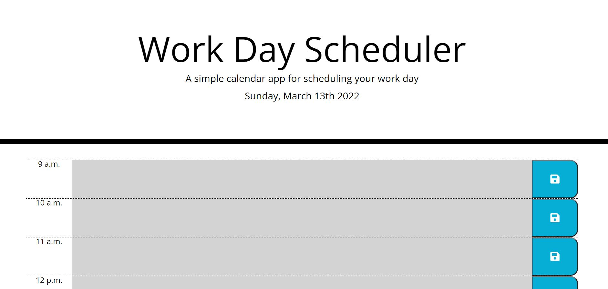

# Work Day-Scheduler

## Description
This Website's function is to track the current day and hour during the workday. The user is able to write in notes into each timeblock and save them. There are nine(9) timeblocks for the work hours of 9 a.m. to 5 p.m. with each color coded to indicate past, present, and future work hours. On a page reload, user added text in each timeblock is loaded onto the page.

## External Resources Used

 - Bootstrap https://stackpath.bootstrapcdn.com/bootstrap/4.3.1/css/bootstrap.min.css
 - FontAwesome https://use.fontawesome.com/releases/v5.8.1/css/all.css
 - Google Fonts https://fonts.googleapis.com/css?family=Open+Sans&display=swap
 - JQuery https://code.jquery.com/jquery-3.4.1.min.js
 - Moment.js https://cdnjs.cloudflare.com/ajax/libs/moment.js/2.24.0/moment.min.js

## Construction
This website was constructed using html to organize containers and add the heading text. Bootstrap and a stylesheet were added to decorate and organize the webpage. the FontAwesome API was used to insert a save icon onto the save button. The GoogleFont API is used to add the Open Sans font family to the page.
The date in the header is retrieved using the API Moment.js. Moment.js is also used to dynamically updated each timeblock's class through the DOM. This allows eachtimeblock to be dynamically updated to reflect whether a certain hour has passed, is current, or is in the future.
User inserted data is stringified saved into the localStorage when the user clicks the corresponding save button. On the page load, user inserted text is retrieved from the localStorage and parsed, and then apllied to each appropriate timeblock through the DOM.

## Author
Robert D Gonzales - https://github.com/SabotageCat / robert.gonzo13@yahoo.com